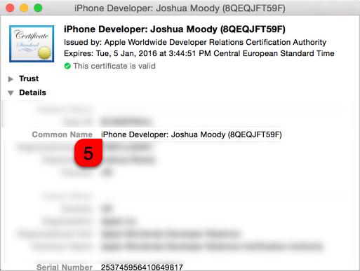

## Resigning with briar

The briar gem is a Calabash iOS workflow tool.  Once you have assembled the necessary assets, you will be able to resign almost any .ipa.

### Quick Instructions

```
1. $ git clone git@github.com:jmoody/briar-resigning-example.git
2. $ cd briar-resigning-example                   # The working directory.
3. $ bundle install
4. Assemble the code signing assets.
5. $ {vim | emacs | open -a TextEdit} .env        # Edit to match your environment
6. $ bundle exec briar resign your.ipa
```

### Assembling the Assets

#### 1. Code Signing Identity

Open the **Keychain Access** application and follow the instructions in the images below to find your Code Signing Identity.  You should choose an **iPhone Developer** certificate, _not_ an iPhone Distribution certificate.

```
$ open /Applications/Utilities/Keychain\ Access.app
```
===


===



Update the `.env` file with your code signing identity.

```
BRIAR_SIGNING_IDENTITY="iPhone Developer: Joshua Moody (8QXXXXXX9F)"
```

#### 2. Developer mobileprovision.

This is hardest step because finding an appropriate .mobileprovision is difficult.  This is the criteria:

1. Needs to include the certificate associated with your Code Signing Identity from **Step 1** above.
2. Must be a **development**, _not_ a distribution, profile.  UIAutomation is not allowed when an app is code signed with a distribution profile.
3. Must be a wildcard profile or must contain the bundle identifier of the app that is going to be resigned.
4. Include any device UDIDs that you want to install the .ipa on.


Your .mobileprovisions can be found in:

```
$ open ~/Library/MobileDevice/Provisioning\ Profiles
```

However, the name of the profile contains no information about the contents - you can't know anything about the profile by looking at the name.

Some developers keep copies of their .mobileprovision files and certificates with the project source code.  This allows all the developers to stay in sync.

If you don't have a profile handy and finding an appropriate one is difficult, you can generate a new one without too much trouble.   In the [WILDCARD.md](WILDCARD.md) I demonstrate how to generate a new wildcard provisioning profile.

Once you have an appropriate mobileprovision handy, copy it to the working directory directory and update the `.env` file.  If the mobileprovision has spaces in the name, be sure to wrap the path with double-quotes (`"`). 

```
# Examples
BRIAR_MOBILE_PROFILE="/path/to/your/wildcard-or-development.mobileprovision"
BRIAR_MOBILE_PROFILE="./Example Wildcard Development.mobileprovision"
```

#### 3. App Prefix Identifier

Now we must inspect the mobileprovision from **Step 2** to find the value of the `ApplicationIdentifierPrefix` key.

We'll use Unix `less` to inspect the profile.  The value we are looking for will be near the top, in the first dozen lines.  I give two examples below: the Wildcard Identifier case and the Team Identifier case.  Your profile will (probably) contain one or the other.  

If you find yourself paging down in `less`, you have gone too far.

```
$ less -f "/path/to/your/wildcard-or-development.mobileprovision"

# Example: Wildcard Identifier
 <key>AppIDName</key>
    <string>Xcode: Wildcard AppID</string>
    <key>ApplicationIdentifierPrefix</key>
    <array>
      <string>Y5XXXXXX74</string>          <== COPY THIS VALUE
    </array>
...

# Example:  Team Identifier
<key>AppIDName</key>
  <string>MyAmazing iOS App Id</string>
  <key>ApplicationIdentifierPrefix</key>
  <array>
      <string>TYXXXXXX3V</string>          <== COPY THIS VALUE
  </array>
...
```

Update the `.env` file with the value you found in your .mobileprovision.

```
BRIAR_APP_PREFIX_IDENTIFIER="Y5XXXXXX74"
```

#### The ipa

Copy the .ipa you want to resign to the `resigning-example` directory.

### Resigning

See the Quick Instructions at the top of this file.


 
