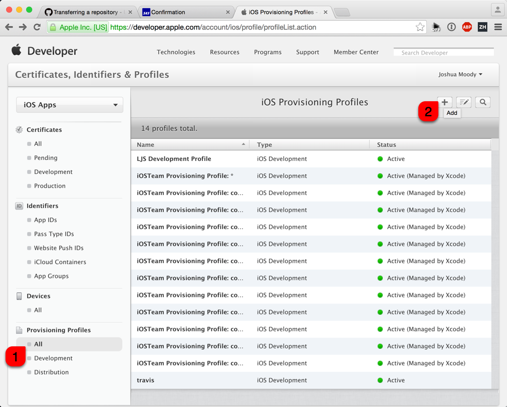
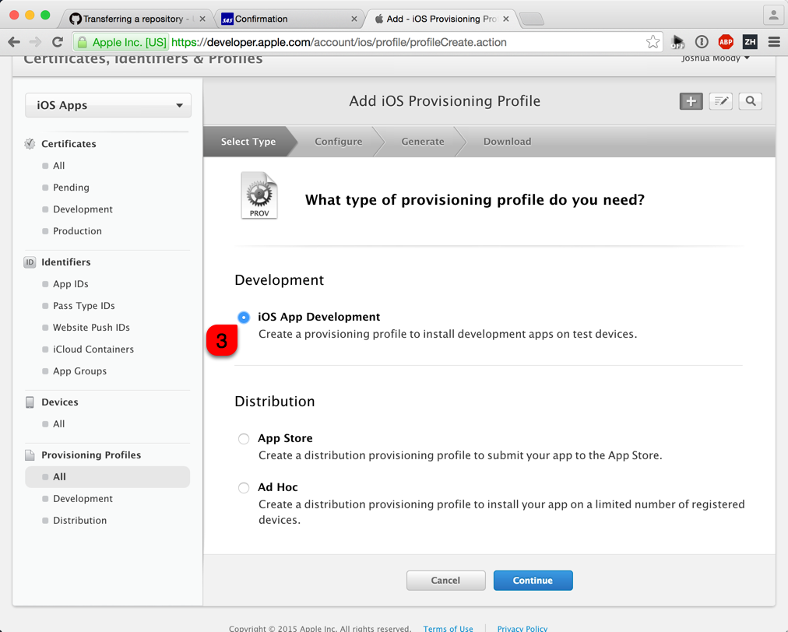
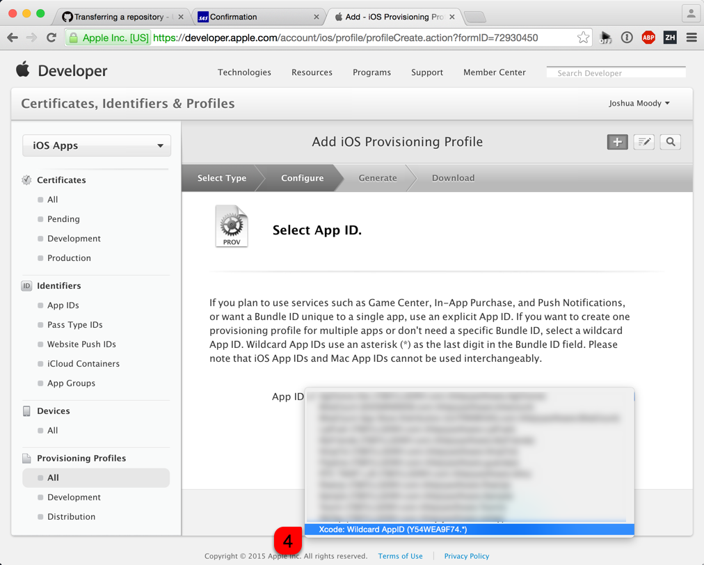
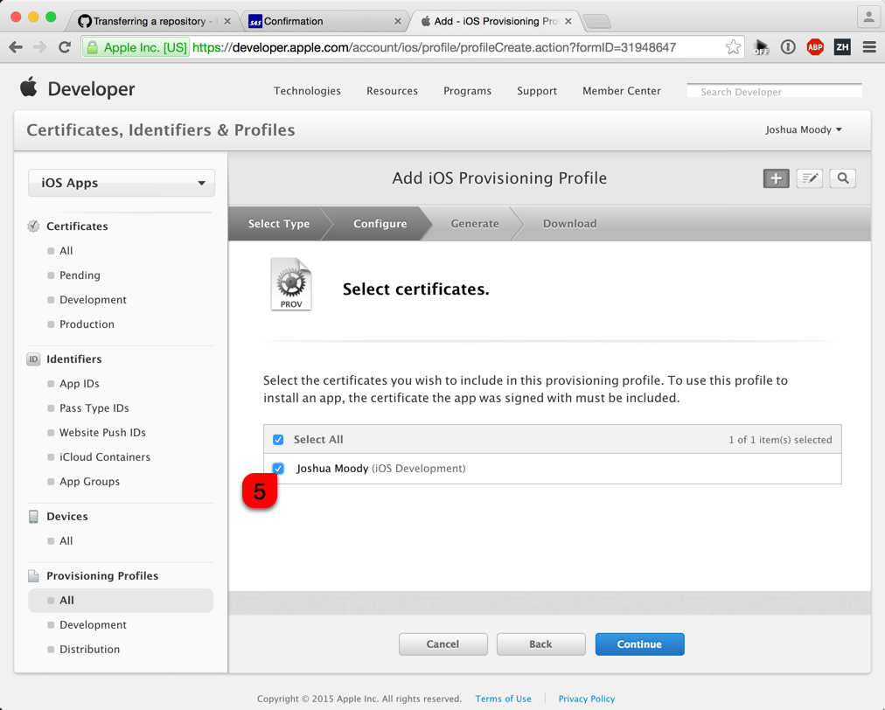
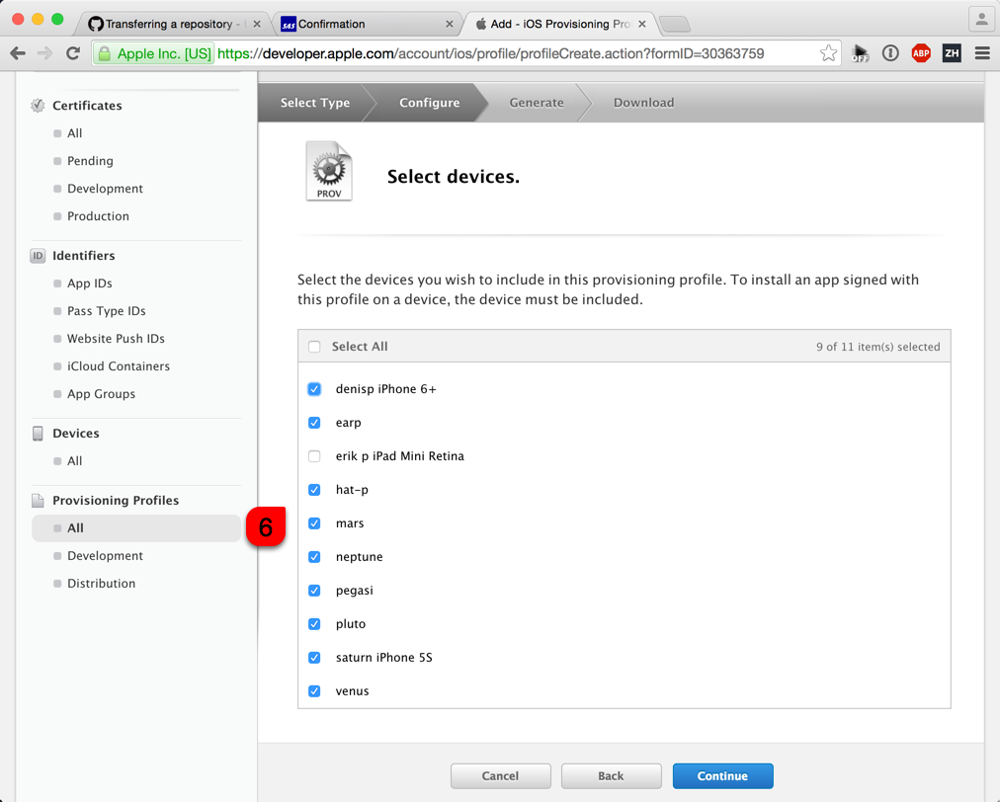
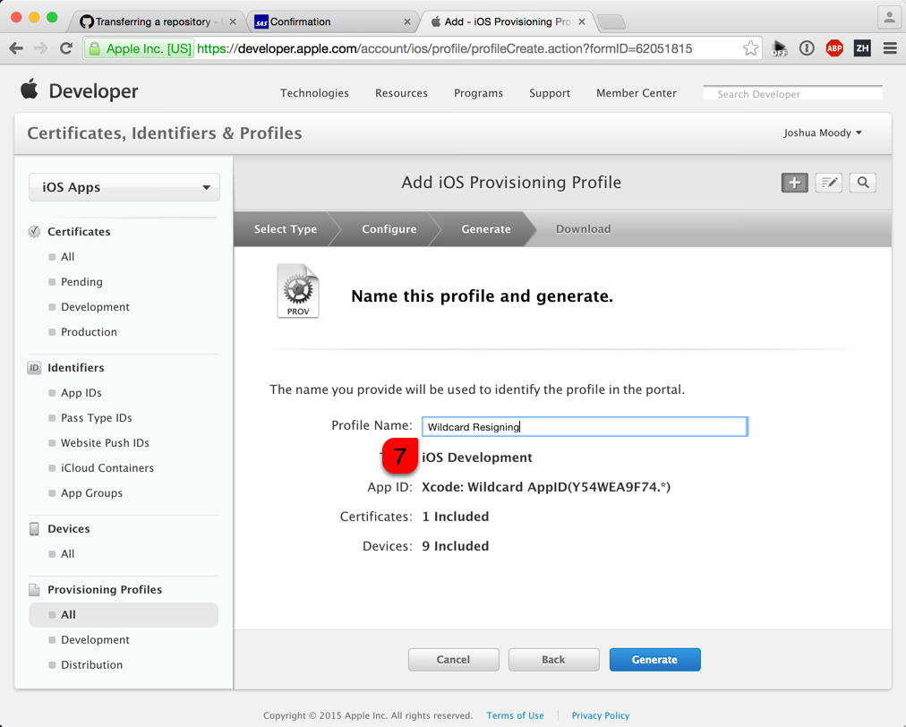

## Generate a Wildcard Provisioning Profile

Log into http://developer.apple.com

## Add Profile

## Choose Development Profile

## Choose Wildcard App Id

## Associate with Developer Certificate

## Select Devices

## Generate the Profile

